# 🔔 Notification Center — Flow Diagrams

> All diagrams use [Mermaid](https://mermaid.js.org/) syntax.  
> Render in GitHub, VS Code (Markdown Preview Mermaid Support), or [mermaid.live](https://mermaid.live).

---

## Table of Contents

1. [Overall Frontend Architecture](#1-overall-frontend-architecture)
2. [Application Bootstrap Flow](#2-application-bootstrap-flow)
3. [Component Tree & Ownership](#3-component-tree--ownership)
4. [NotificationService — Signal State Flow](#4-notificationservice--signal-state-flow)
5. [WebsocketService — Real-Time Data Flow](#5-websocketservice--real-time-data-flow)
6. [ToastService — Queue Flow](#6-toastservice--queue-flow)
7. [NotificationBell — Component Logic Flow](#7-notificationbell--component-logic-flow)
8. [NotificationDrawer — Component Logic Flow](#8-notificationdrawer--component-logic-flow)
9. [NotificationSearch + Filter + Sort — Pipeline Flow](#9-notificationsearch--filter--sort--pipeline-flow)
10. [NotificationList + Item — Render & Interaction Flow](#10-notificationlist--item--render--interaction-flow)
11. [Toast Component — Display Flow](#11-toast-component--display-flow)
12. [Dashboard — Computed Signal Flow](#12-dashboard--computed-signal-flow)
13. [Full User Interaction Sequence — Mark Read](#13-full-user-interaction-sequence--mark-read)
14. [Full User Interaction Sequence — Delete](#14-full-user-interaction-sequence--delete)
15. [Full User Interaction Sequence — New Notification (WebSocket)](#15-full-user-interaction-sequence--new-notification-websocket)
16. [filteredNotifications Computed Signal — Decision Flow](#16-filterednotifications-computed-signal--decision-flow)
17. [HTTP REST API Interaction Flow](#17-http-rest-api-interaction-flow)
18. [Angular Change Detection & Signal Reactivity Map](#18-angular-change-detection--signal-reactivity-map)

---

## 1. Overall Frontend Architecture

High-level picture of every layer and how they connect.

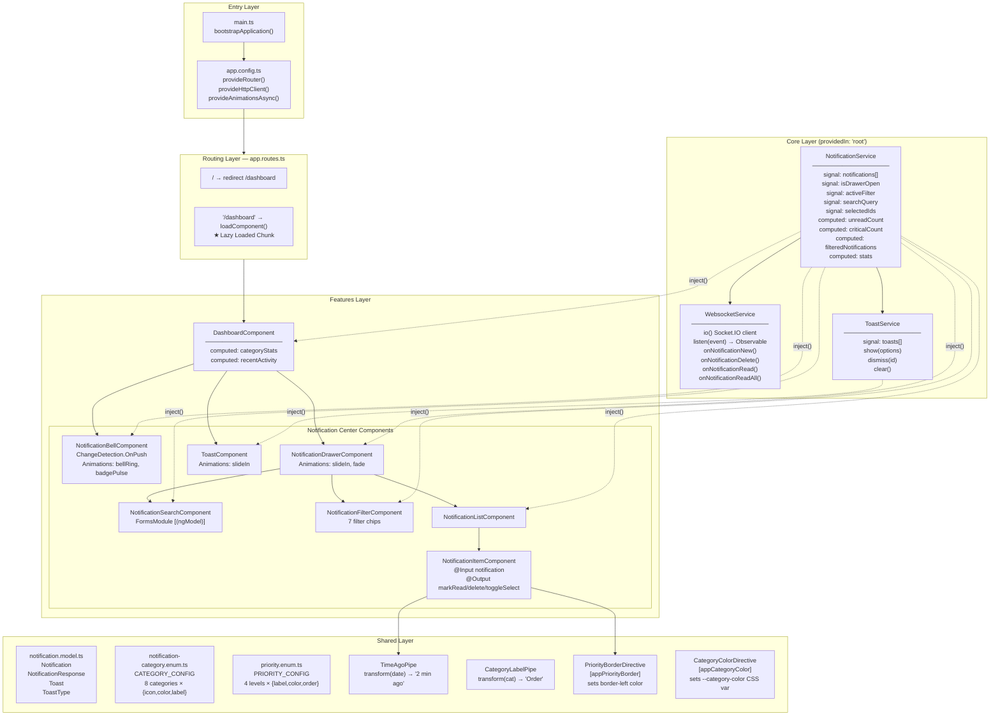

---

## 2. Application Bootstrap Flow

Sequence from `main.ts` load to first data appearing on screen.

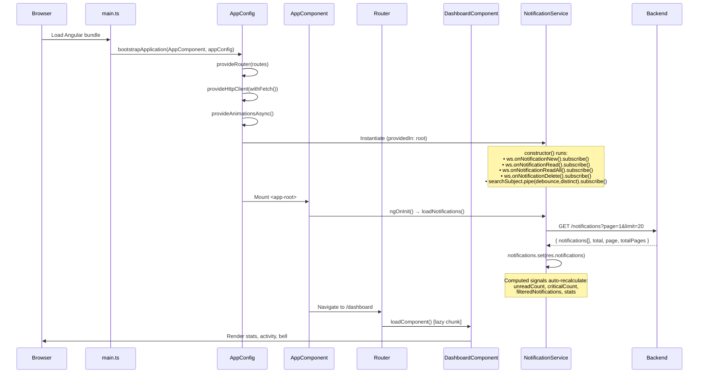

---

## 3. Component Tree & Ownership

Shows parent → child relationships and which service each component injects.

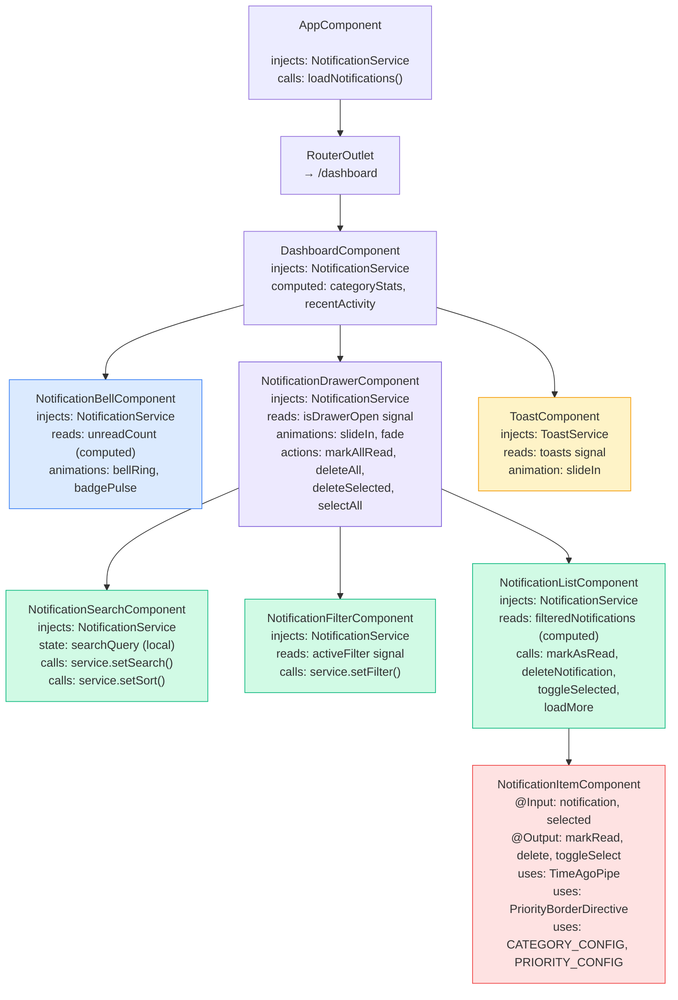

---

## 4. NotificationService — Signal State Flow

How signals, computed signals, and effects relate to each other.

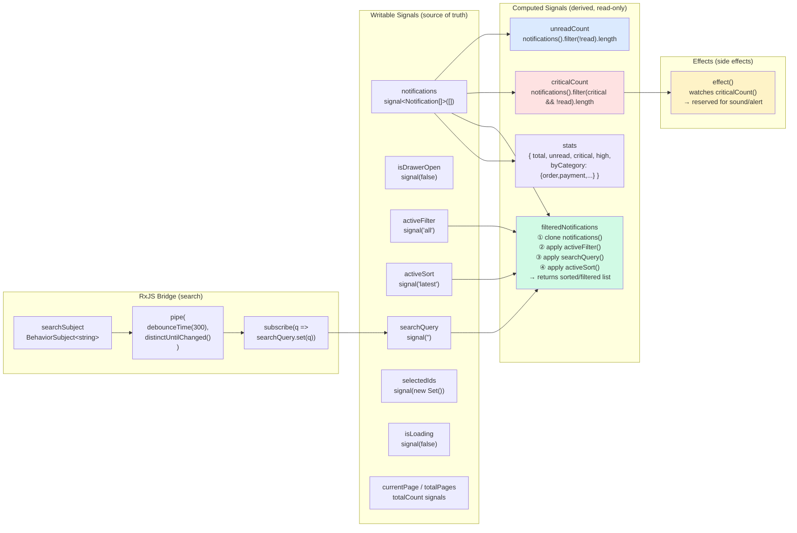

---

## 5. WebsocketService — Real-Time Data Flow

From Socket.IO connection to Angular Signal update.

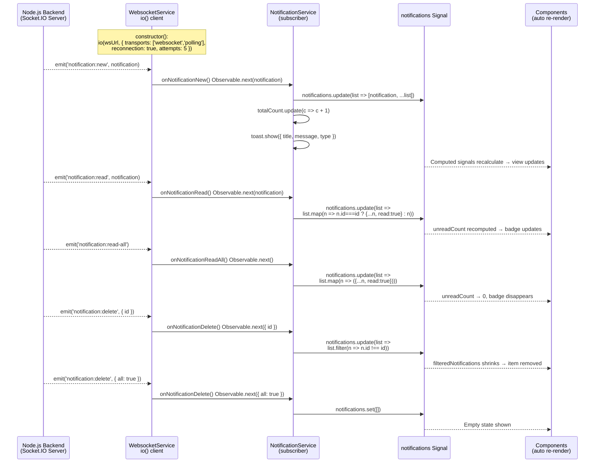

---

## 6. ToastService — Queue Flow

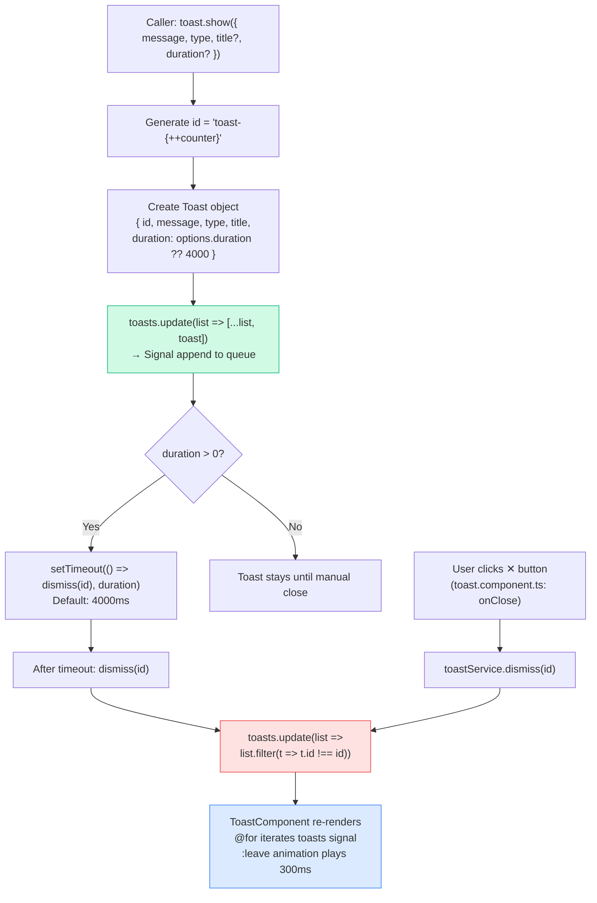

---

## 7. NotificationBell — Component Logic Flow

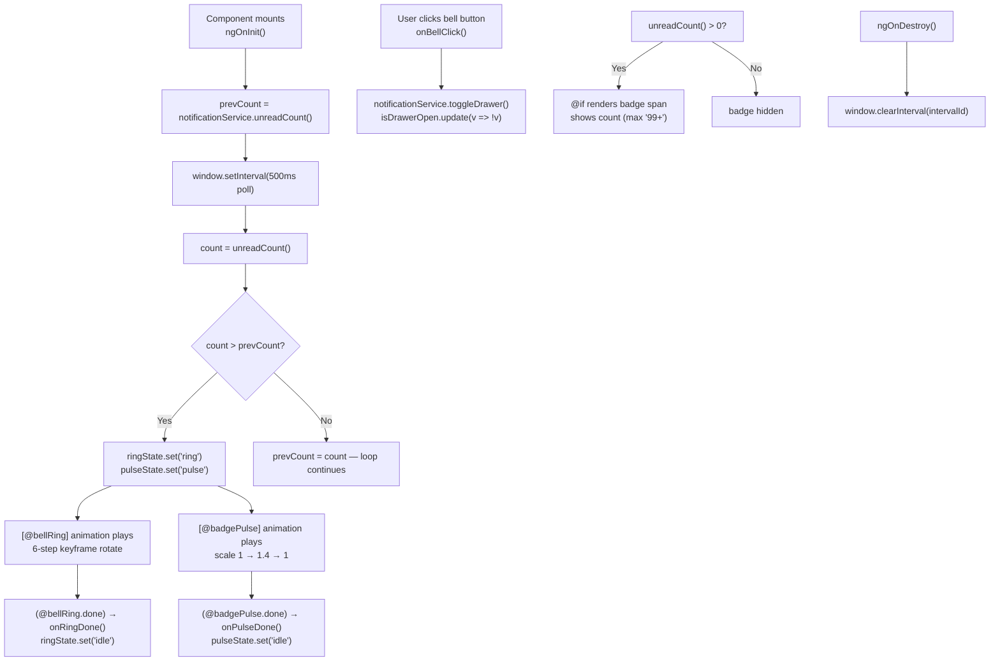

---

## 8. NotificationDrawer — Component Logic Flow

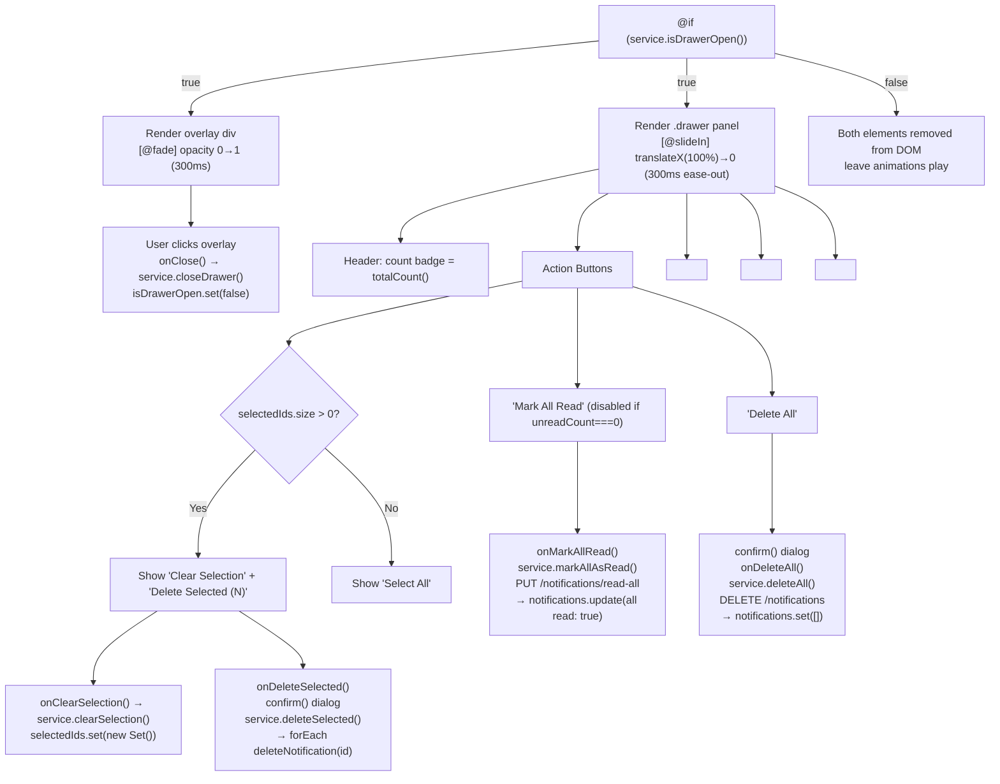

---

## 9. NotificationSearch + Filter + Sort — Pipeline Flow

This shows how user input eventually mutates `filteredNotifications` computed signal.

```mermaid
flowchart LR
    subgraph USER_INPUT["User Input Layer"]
        UI_SEARCH["User types in search box\n[(ngModel)] searchQuery"]
        UI_FILTER["User clicks filter chip\nonFilterChange(FilterType)"]
        UI_SORT["User changes sort select\nonSortChange(Event)"]
    end

    subgraph SEARCH_PIPE["Search RxJS Pipeline\n(NotificationService constructor)"]
        SP1["onSearchChange()\nservice.setSearch(query)"]
        SP2["searchSubject.next(query)\nBehaviorSubject"]
        SP3["debounceTime(300)\nWait 300ms after last keystroke"]
        SP4["distinctUntilChanged()\nSkip if same value"]
        SP5["searchQuery.set(query)\nWrite to Signal"]
    end

    subgraph SIGNAL_WRITES["Signal Writes"]
        SW1["activeFilter.set(filter)"]
        SW2["activeSort.set(sort)"]
    end

    subgraph COMPUTED["filteredNotifications = computed()"]
        CP1["1. Clone notifications()"]
        CP2["2. switch(activeFilter())\n• all → no-op\n• read → .filter(n.read)\n• unread → .filter(!n.read)\n• high → priority==='high'||'critical'\n• critical → priority==='critical'\n• today → timestamp >= today 00:00\n• week → timestamp >= 7 days ago"]
        CP3["3. if searchQuery:\n.filter(title/category/sender/description\n  .toLowerCase().includes(query))"]
        CP4["4. switch(activeSort())\n• latest → sort by timestamp DESC\n• oldest → sort by timestamp ASC\n• priority → sort by {critical:4,high:3,...}\n• category → localeCompare()"]
        CP5["Return final list\n→ NotificationListComponent renders it"]
    end

    UI_SEARCH --> SP1 --> SP2 --> SP3 --> SP4 --> SP5
    UI_FILTER --> SW1
    UI_SORT --> SW2
    SP5 --> CP1
    SW1 --> CP1
    SW2 --> CP1
    CP1 --> CP2 --> CP3 --> CP4 --> CP5
```

---

## 10. NotificationList + Item — Render & Interaction Flow

```mermaid
flowchart TD
    A["NotificationListComponent renders"]
    A --> B{isLoading() && notifications().length === 0}
    B -- true --> C["Show skeleton 'Loading...'"]
    B -- false --> D{filteredNotifications().length === 0}
    D -- true --> E["Empty state: '📭 No notifications found'"]
    D -- false --> F["@for (notification of filteredNotifications(); track notification.id)"]

    F --> G["<app-notification-item\n  [notification]='n'\n  [selected]='isSelected(n.id)'\n  (markRead)='onMarkRead($event)'\n  (delete)='onDelete($event)'\n  (toggleSelect)='onToggleSelect($event)' />"]

    G --> H["NotificationItemComponent renders"]
    H --> I["[appPriorityBorder]='priority'\n→ border-left: 4px solid {color}"]
    H --> J{"notification.read === false?"}
    J -- false --> K["class 'unread':\n• background: #eff6ff\n• title font-weight: 700\n• blue left dot ::before"]
    J -- true --> L["Normal background"]
    H --> M{"priority === 'critical'?"}
    M -- true --> N["class 'critical':\n• background: #fef2f2\n• border-color: #ef4444"]

    H --> O["User clicks item body\nonMarkRead() — if !read:\n  markRead.emit(id)\n  → list.onMarkRead(id)\n  → service.markAsRead(id)\n  → PUT /:id/read\n  → notifications.update(read:true)"]

    H --> P["User clicks ✕\nonDelete(event)\nevent.stopPropagation()\ndelete.emit(id)\n→ service.deleteNotification(id)"]

    H --> Q["User clicks checkbox\nonToggleSelect(event)\nevent.stopPropagation()\ntoggleSelect.emit(id)\n→ service.toggleSelected(id)\nselectedIds adds/removes id"]

    A --> R{currentPage() < totalPages()}
    R -- true --> S["Show 'Load More' button\nonLoadMore()\n→ service.loadMore()\n→ loadNotifications(page+1)\n→ notifications.update([...list, ...res])"]
```

---

## 11. Toast Component — Display Flow

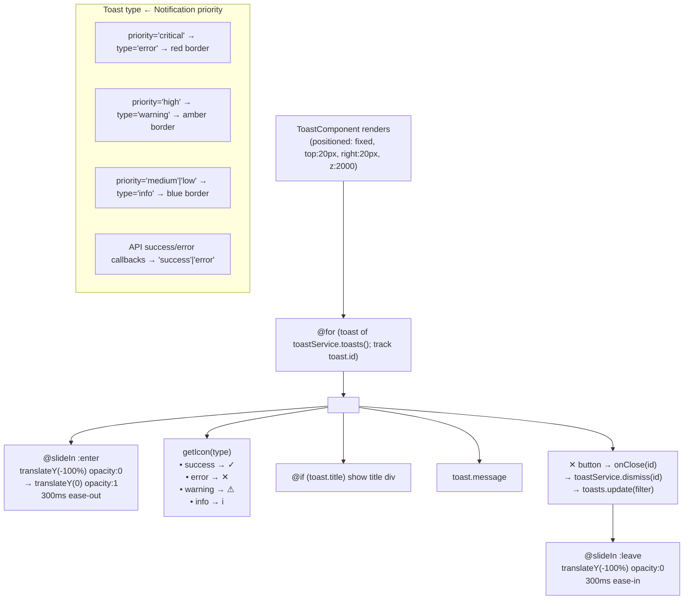

---

## 12. Dashboard — Computed Signal Flow

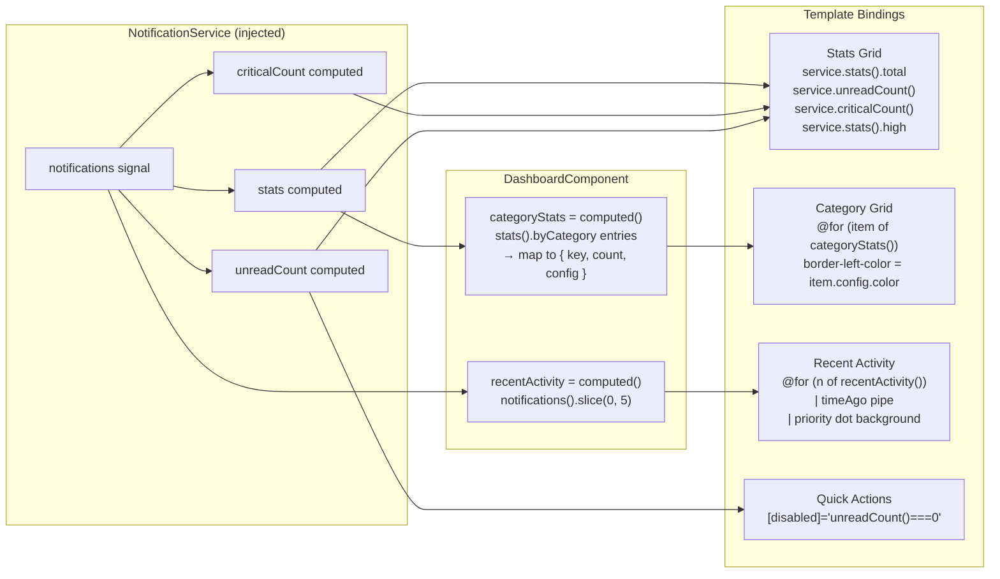

---

## 13. Full User Interaction Sequence — Mark Read

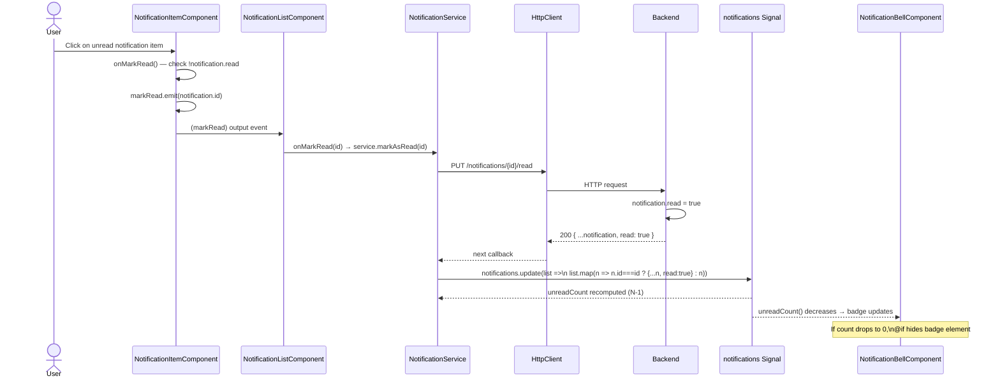

---

## 14. Full User Interaction Sequence — Delete

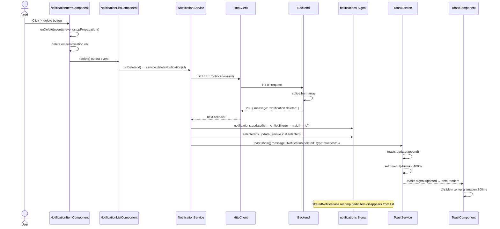

---

## 15. Full User Interaction Sequence — New Notification (WebSocket)

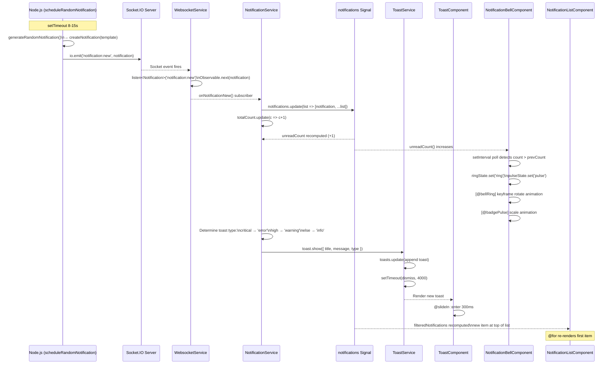

---

## 16. filteredNotifications Computed Signal — Decision Flow

Detail of the three-stage pipeline inside the `computed()` call.

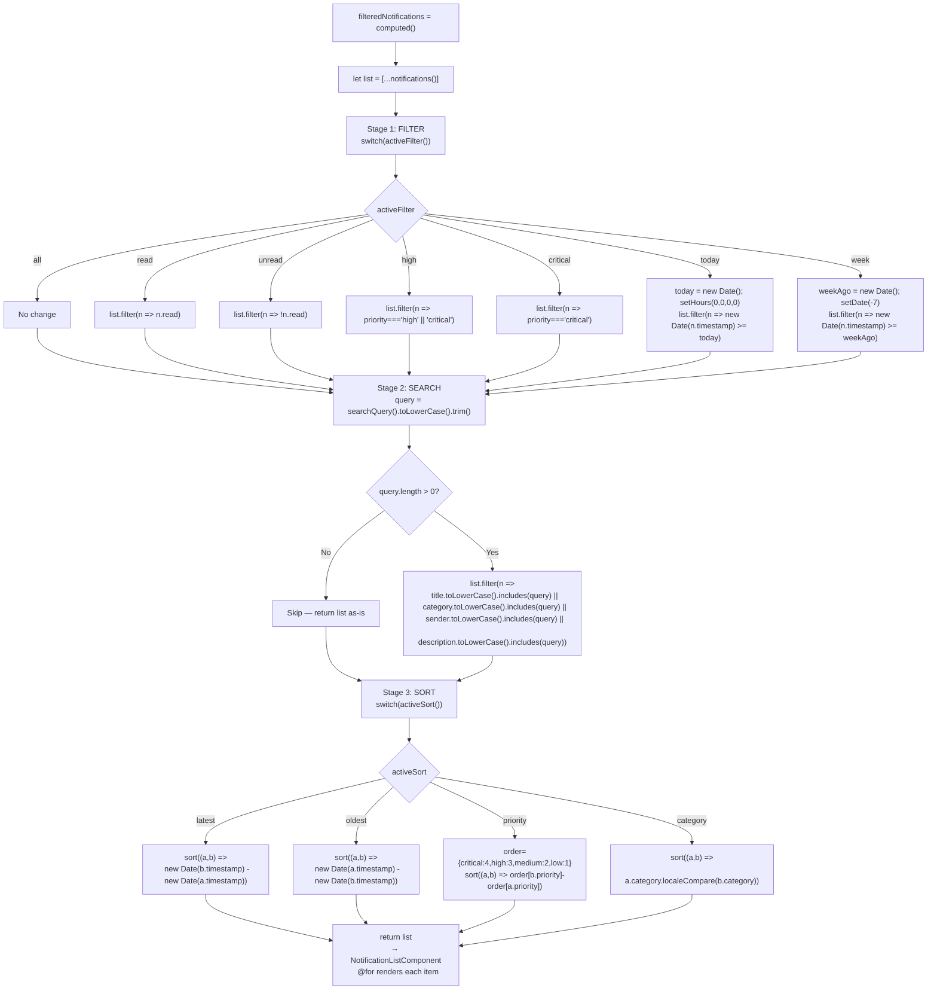

---

## 17. HTTP REST API Interaction Flow

All HTTP calls from `NotificationService` mapped to backend routes.

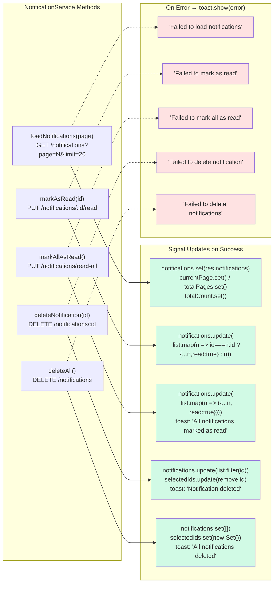

---

## 18. Angular Change Detection & Signal Reactivity Map

How a single backend push cascades through the entire signal graph to update every view.

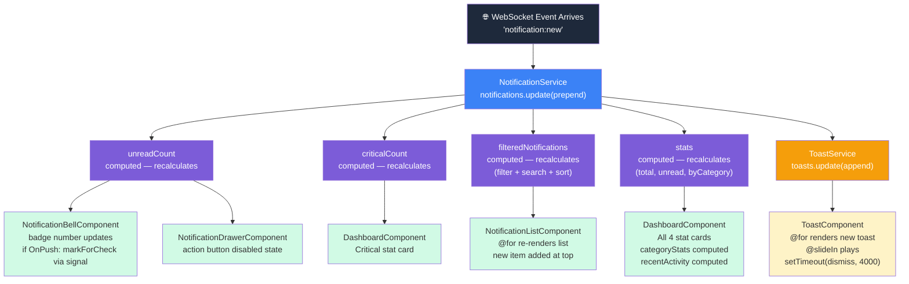

---

*Generated from source code analysis of the Angular 19 Notification Center project.*
