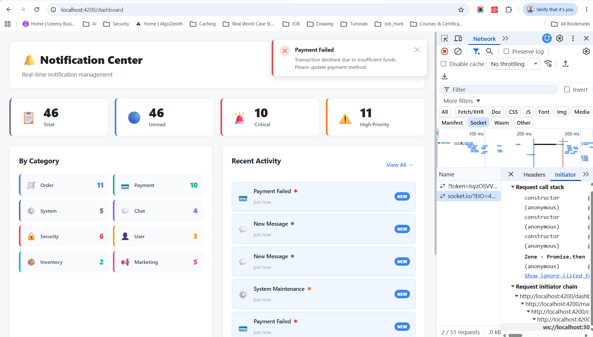

# Real-Time Notification Center

A production-ready notification center built with **Angular 19** (Signals, Standalone Components, Control Flow) + **Node.js** (Express, Socket.IO, TypeScript).



## Features

- 🔔 **Real-time notifications** via WebSocket (Socket.IO)
- 📡 **Backend pushes** new notifications every 8–15 seconds
- 🔵 **Unread badge counter** using Angular Computed Signals
- 🎛️ **Filter & sort** by category, priority, date
- 🔍 **Search** with RxJS debounce + distinctUntilChanged
- 🍞 **Toast notifications** with auto-dismiss and queue
- ✓ **Mark read / unread / mark all read**
- 🗑️ **Delete one / multiple (with checkboxes) / all**
- 📊 **Dashboard** with live stats and category breakdown
- 📱 **Responsive** mobile-friendly layout
- 🎭 **Angular Animations** — bell ring, drawer slide, toast slide
- 8 notification **categories** with unique colors and icons
- 4 **priority levels** with visual indicators

## Tech Stack

| Layer | Technology |
|---|---|
| Frontend | Angular 19, Standalone, Signals, RxJS, SCSS |
| Backend | Node.js, Express, Socket.IO, TypeScript |
| Transport | WebSockets (Socket.IO) + REST APIs |
| Data | In-memory mock database |

## To Run
```
cd backend && npm run dev     # → http://localhost:3000
cd frontend && npm start      # → http://localhost:4200
```

## Quick Start

### 1. Install dependencies

```bash
# Backend
cd backend
npm install

# Frontend
cd ../frontend
npm install
```

### 2. Start the backend

```bash
cd backend
npm run dev
# Server: http://localhost:3000
```

### 3. Start the frontend

```bash
cd frontend
npm start
# App: http://localhost:4200
```

## API Reference

| Method | Endpoint | Description |
|---|---|---|
| GET | `/notifications` | List notifications (paginated) |
| GET | `/notifications/:id` | Get notification by ID |
| POST | `/notifications` | Create notification |
| PUT | `/notifications/:id/read` | Mark as read |
| PUT | `/notifications/read-all` | Mark all read |
| DELETE | `/notifications/:id` | Delete one |
| DELETE | `/notifications` | Delete all |

## WebSocket Events

| Event | Direction | Description |
|---|---|---|
| `notification:new` | Server → Client | New notification arrived |
| `notification:read` | Server → Client | Notification marked read |
| `notification:read-all` | Server → Client | All marked read |
| `notification:delete` | Server → Client | Notification(s) deleted |
| `notification:update` | Server → Client | Notification updated |

## Angular Architecture Highlights

```
src/app/
├── core/
│   ├── animations/         # Reusable Angular animations
│   └── services/
│       ├── notification.service.ts   # Signal-based state management
│       ├── websocket.service.ts      # Socket.IO RxJS wrapper
│       └── toast.service.ts          # Toast queue management
├── shared/
│   ├── models/             # TypeScript interfaces
│   ├── enums/              # Category & priority configs
│   ├── pipes/              # timeAgo, categoryLabel
│   └── directives/         # priorityBorder, categoryColor
└── features/
    ├── dashboard/           # Main dashboard view
    └── notification-center/ # All notification components
        └── components/
            ├── notification-bell/
            ├── notification-item/
            ├── notification-list/
            ├── notification-filter/
            ├── notification-search/
            ├── notification-drawer/
            └── toast/
```

## Socket End-to-End Lifecycle
```
Angular App
     │
     │ io("http://localhost:3000")
     ▼
Socket.IO Server
     │
     ▼
connection event
     │
     ▼
socket created
     │
     ├────────► disconnect
     │
     └────────► notification:request
                     │
                     ▼
      generateRandomNotification()
                     │
                     ▼
      io.emit('notification:new', notification)
                     │
         ┌───────────┼───────────┐
         ▼           ▼           ▼
     Client A    Client B    Client C
                     │
                     ▼
          Angular UI updates instantly
```
This pattern—client emits an event to the server, the server processes it, and then broadcasts a result to all interested clients—is the core communication model used in many real-time applications such as chat systems, live dashboards, multiplayer games, collaborative editors, and notification services.


### Angular 19 Signals Pattern

```typescript
// Computed Signal — updates automatically
readonly unreadCount = computed(() =>
  this.notifications().filter(n => !n.read).length
);

// Effect — side effects when signals change
effect(() => {
  if (this.criticalCount() > 0) { /* play sound */ }
});
```
